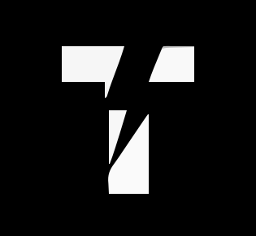

  

<table align="center" border="0" cellpadding="0" cellspacing="0" width="100%">
  <tr>
    <td align="left" width="70%" valign="top">
      <h1>Hello, I am Tushar Y Nayaka</h1>
      
<b>Computer Science Engineering Student | Bengaluru, India</b>

      
I am a developer focusing on building high-performance applications and contributing to the open-source community. I enjoy turning complex logic into simple, effective real-world solutions.

      

        
        
        
        
      

      
    </td>
    <td align="right" width="30%" valign="middle">
      
    </td>
  </tr>
</table>

---

### Tech Stack

  

---

### Featured Projects

<b>Click to View Projects</b>

 

  <a href="https://orbittyn.vercel.app/">
    
  </a>
  

    <h4>Orbit</h4>
    
Unified ecosystem for campus commerce and ride-pooling via domain-verified networks.

    
      
    
  

 

  <a href="https://ethos-ledger.vercel.app">
    
  </a>
  

    <h4>EthosLedger</h4>
    
Decentralized approach to academic and professional credentialing for Genesys 2.0.

    
      
    
  

 

  
  

    <h4>Emotion and Attention AI</h4>
    
Research : Real-time AI system analyzing facial expressions and gaze for engagement monitoring.

    
    
  

 

  <a href="https://meetmate-eight.vercel.app/">
    
  </a>
  

    <h4>MeetMate</h4>
    
Smart location tool designed to find optimal meeting points between multiple users.

      
    
  

 

<!-- 

  <a href="https://terraalertum.vercel.app/">
    
  </a>
  

    <h4>TerraAlertum</h4>
    
Interactive platform designed to monitor and report environmental changes.

      
    
  
 -->

 

---

### Competitive Programming and Rhythm

<table width="100%" align="center">
  <tr>
    <td width="50%" align="center" valign="top">
      <h4>LeetCode Mastery</h4>
      <a href="https://leetcode.com/Tushar_Y_Nayaka/">
        
      </a>
    </td>
    <td width="50%" align="center" valign="top">
      <h4>Recently Played</h4>
      
    </td>
  </tr>
</table>

---

### GitHub Insights

  
   
  
  
  

---

  
    
  <h3>Thanks for visiting</h3>
  
  
<i>Built by Tushar Y Nayaka</i>

